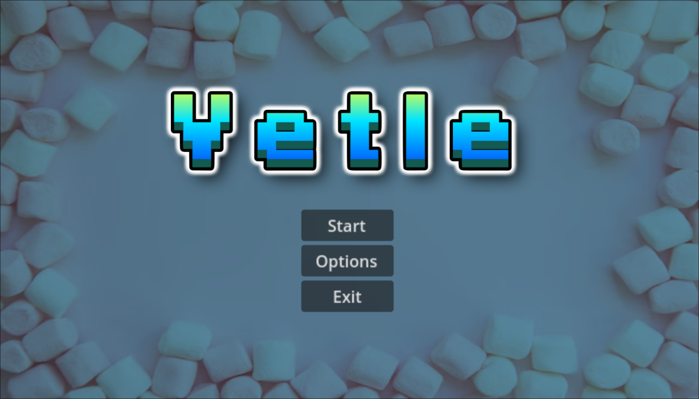
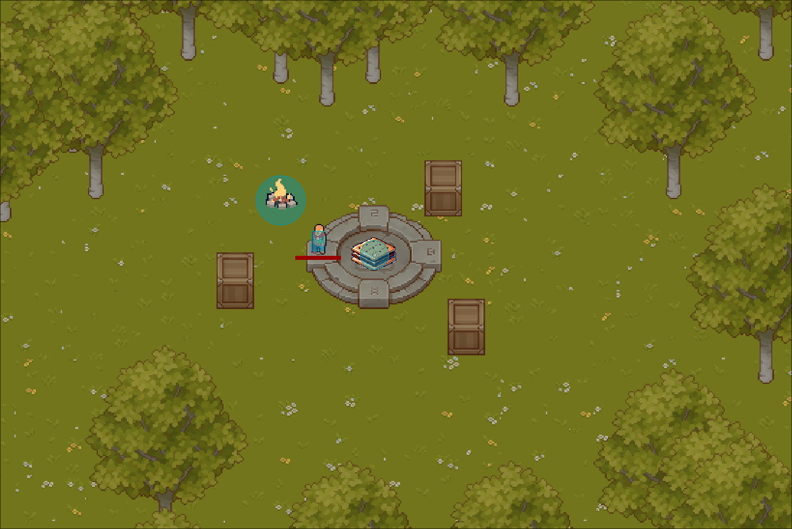

# Marshmallow Roasting Game

Welcome to **Marshmallow Roasting Game**, a hilarious and chaotic word-roasting adventure where you trash-talk an AI-powered LLM, lead it on a chase, and guide it to the “Shmore” for points!

## 🏆 Game Objective
Roast marshmallows by hurling words (or insults!) at them. Your target is an LLM-powered marshmallow that gets progressively madder the more you roast it. Use your wits and agility to lead the furious marshmallow into the “Shmore” and score big!

---

## 🚀 Screenshots

---

## 🚀 Features
- **AI-Powered Marshmallows**: Roast marshmallows driven by an LLM that responds to your words.
- **Dynamic Gameplay**: Anger the marshmallow with clever insults and watch it react hilariously!
- **Point Scoring System**: Lead roasted marshmallows to the “Shmore” to score points.

---

## 🛠 Game Engine

This game is made with Godot, and only ran within it. It was never exported.

---

## 💡 How to Play
1. **Run the Game**
   Run the game.

2. **Trash Talk the Marshmallow**  
   Use creative words to roast the marshmallow. Watch its reaction as it gets madder with each roast!

3. **Lead It to the “Shmore”**  
   Navigate the map and guide the marshmallow into the “Shmore” zone to score points. Be careful—too much trash talk might make it go berserk!

4. **Win Big**  
   Earn points for each marshmallow successfully roasted and “S'mored.” Compete with your friends to see who’s the ultimate roaster!

---

## 🖌 Development Notes
- The project is written in **C#** and uses **Godot** for game development.
- **grocclient** is required to manage interactions with the LLM-powered marshmallows.
- Contributions are welcome! Feel free to submit a pull request or open an issue.

---

## 🎮 Credits
- **Game Design**: Me
- **Powered By**: Groq API & Godot Engine
- **Special Thanks**: To everyone who loves roasting marshmallows—literally or figuratively!

Happy roasting! 🔥

